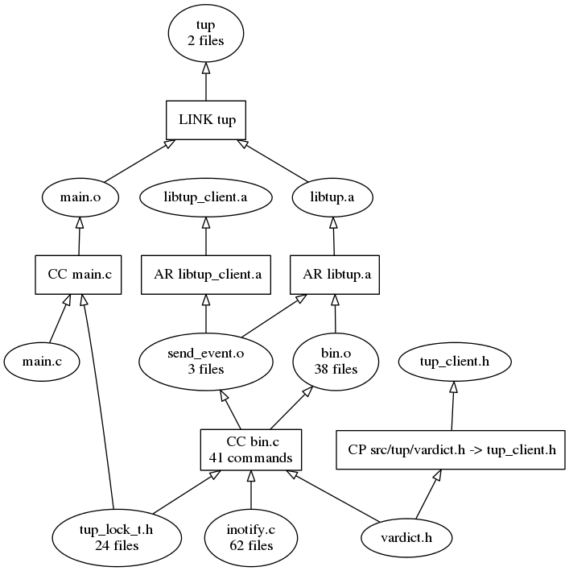
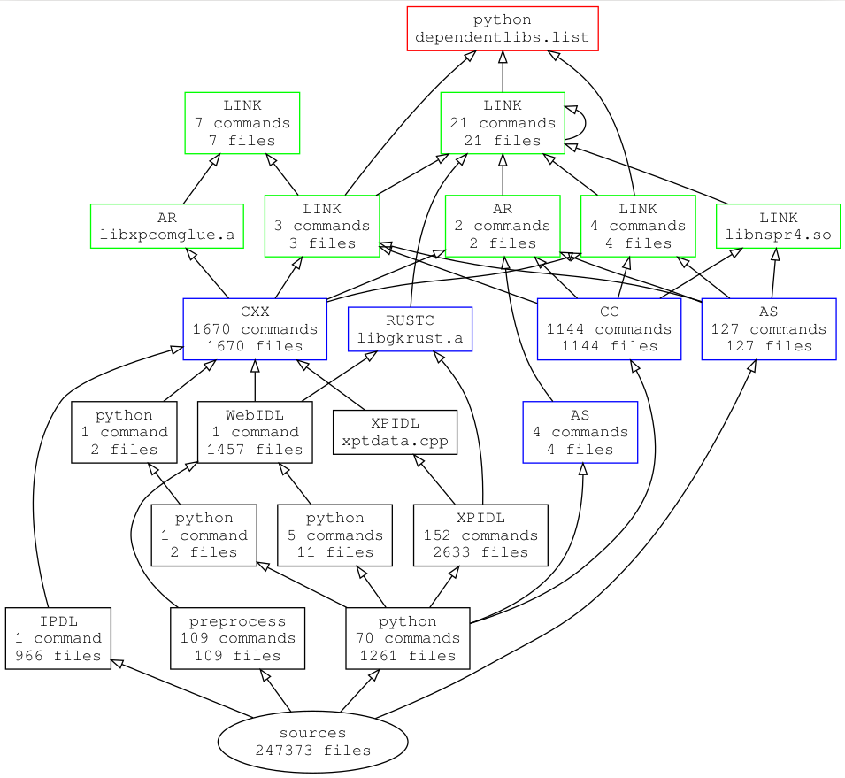

Amongst build systems, Tup has the very nice feature that it can emit a graphviz representation of the dependency graph of the current build. Mike Shal, the author of Tup, even went further by implementing some simplification strategies to merge similar nodes. In the end, the build graph of Tup itself looks like this. You can find more about this process on [Mike Shal's blog].

{.image-medium .center}

[Mike Shal's blog]: http://gittup.org/blog/2015/01/12-combining-nodes-in-graphviz/

While amazing on some relatively small examples, the compression strategy fails to deliver on larger graphs, such as firefox itself. I decided to tackle this issue, and produce a readable graph. In this blog, I will describe the process that led me to the following, compressed representation of Firefox's dependency graph.

{.image-large .center}

